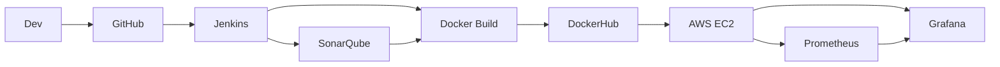

# 🚀 DevOpsProject2 – CI/CD avec Docker, Jenkins, SonarQube, Prometheus et Grafana

## 📌 Description

Ce projet illustre la mise en place d'un **pipeline CI/CD complet** pour une application web. L'objectif est d'automatiser **les tests, le build, le déploiement** et d'assurer la **supervision** via un ensemble d'outils DevOps.

---

## ⚙️ Outils utilisés

- **Jenkins** : orchestration CI/CD
- **GitHub** : gestion du code source
- **SonarQube** : analyse qualité et sécurité du code
- **Docker & DockerHub** : conteneurisation et registre d'images
- **AWS EC2 (Ubuntu)** : déploiement de l'application
- **Prometheus + Grafana** : monitoring et visualisation

---

## 🛠️ Architecture du projet



---

## 🐳 Dockerfile

```dockerfile
# Use Node.js Alpine base image
FROM node:alpine

# Create and set the working directory inside the container
WORKDIR /app

# Copy package.json and package-lock.json to the working directory
COPY package.json package-lock.json /app/

# Install dependencies
RUN npm install

# Copy the entire codebase to the working directory
COPY . /app/

# Expose the port your container app
EXPOSE 3000    

# Define the command to start your application
CMD ["npm", "start"]
```

### 🚀 Commandes Docker manuelles

```bash
# Build de l'image Docker
docker build -t hamzus17/devopsproject2 .

# Exécution du conteneur en local
docker run -d -p 3000:3000 --name devops-app hamzus17/devopsproject2

# Arrêt et suppression du conteneur
docker stop devops-app
docker rm devops-app

# Push vers DockerHub (après login)
docker login -u hamzus17
docker push hamzus17/devopsproject2:latest
```

---

## 🔄 Jenkins Pipeline

Voici le `Jenkinsfile` utilisé pour automatiser tout le processus CI/CD :

```groovy
pipeline {
    agent any

    parameters {
        choice(
            name: 'ENVIRONMENT',
            choices: ['dev', 'prod'],
            description: 'Choisir l environnement de déploiement'
        )
    }

    environment {
        DOCKERHUB_CREDENTIALS = credentials('dockerhub-credentials-id')
        DOCKER_IMAGE = "hamzus17/devopsproject2"
        DOCKER_TAG = "${params.ENVIRONMENT}"
        SONAR_TOKEN = credentials('sonar-token2')
    }

    stages {
        stage('Checkout') {
            steps {
                git branch: 'main', url: 'https://github.com/hamzus17/jenkins-pipeline-complete.git'
            }
        }

        stage('Build') {
            steps {
                echo "🏗️ Installation des dépendances"
                dir('DevopsProject2-main') {
                    sh 'npm install'
                }
            }
        }

        stage('Test') {
            steps {
                echo "🧪 Lancement des tests"
                dir('DevopsProject2-main') {
                    sh 'npm test -- --passWithNoTests'
                }
            }
        }

        stage('SonarQube Analysis') {
            steps {
                script {
                    dir('DevopsProject2-main') {
                        try {
                            withSonarQubeEnv('sonar-server') {
                                sh """
                                docker run --rm \
                                    -v "\$(pwd):/usr/src" \
                                    -w /usr/src \
                                    sonarsource/sonar-scanner-cli:latest \
                                    -Dsonar.projectKey=DevopsProject2 \
                                    -Dsonar.sources=. \
                                    -Dsonar.host.url=http://localhost:9000 \
                                    -Dsonar.login=\$SONAR_TOKEN
                                """
                            }
                            echo "✅ Analyse SonarQube terminée avec succès"
                        } catch (Exception e) {
                            echo "⚠️ SonarQube analysis failed: ${e.message}"
                        }
                    }
                }
            }
        }

        stage('Build Docker Image') {
            steps {
                echo "🐳 Construction de l'image Docker"
                script {
                    dir('DevopsProject2-main') {
                        sh "docker build -t \$DOCKER_IMAGE:\$DOCKER_TAG ."
                        sh "docker tag \$DOCKER_IMAGE:\$DOCKER_TAG \$DOCKER_IMAGE:latest"
                    }
                }
            }
        }

        stage('Push Docker Image to DockerHub') {
            steps {
                echo "📤 Push de l'image sur DockerHub"
                script {
                    sh """
                    echo \$DOCKERHUB_CREDENTIALS_PSW | docker login -u \$DOCKERHUB_CREDENTIALS_USR --password-stdin
                    docker push \$DOCKER_IMAGE:\$DOCKER_TAG
                    docker push \$DOCKER_IMAGE:latest
                    """
                }
            }
        }

        stage('Deploy') {
            steps {
                echo "🚀 Déploiement sur EC2"
                script {
                    sshagent(['ssh-ec2']) {
                        sh """
                        ssh -o StrictHostKeyChecking=no ubuntu@3.87.95.123 "
                            sudo docker pull \$DOCKER_IMAGE:\$DOCKER_TAG
                            sudo docker stop devops-app || true
                            sudo docker rm devops-app || true
                            sudo docker run -d --name devops-app -p 80:3000 \$DOCKER_IMAGE:\$DOCKER_TAG
                        "
                        """
                    }
                }
            }
        }
    }

    post {
        success {
            echo "🎉 Déploiement réussi pour \${params.ENVIRONMENT}!"
        }
        failure {
            echo "❌ Pipeline échoué pour \${params.ENVIRONMENT}"
        }
    }
}
```

### 📋 Étapes du Pipeline CI/CD

1. **Checkout** : Récupération du code source depuis GitHub
2. **Build & Test** : Installation des dépendances et exécution des tests
3. **Analyse SonarQube** : Vérification de la qualité du code
4. **Build Docker** : Création de l'image Docker
5. **Push DockerHub** : Envoi de l'image vers DockerHub
6. **Déploiement EC2** : Déploiement automatique sur AWS
7. **Monitoring** : Supervision via Prometheus et Grafana

---

## 🔍 Monitoring

### Prometheus
- **Collecte** : Métriques depuis l'EC2 et les conteneurs
- **Port** : 9090
- **URL** : `http://<EC2-IP>:9090`

### Grafana
- **Visualisation** : Dashboards en temps réel
- **Port** : 3000
- **URL** : `http://<EC2-IP>:3000`
- **Identifiants par défaut** : admin/admin

### Configuration Prometheus (exemple)
```yaml
global:
  scrape_interval: 15s

scrape_configs:
  - job_name: 'devops-app'
    static_configs:
      - targets: ['localhost:3000']
```

---

## 📦 Déploiement

### Déploiement automatique
Après un push sur la branche `main` :
- Jenkins exécute le pipeline automatiquement
- Une nouvelle image Docker est générée et publiée
- L'application est déployée sur EC2 avec `docker run`

### Déploiement manuel
```bash
# Connexion à l'instance EC2
ssh -i "your-key.pem" ubuntu@<EC2-IP>

# Pull et run de l'image Docker
sudo docker pull hamzus17/devopsproject2:latest
sudo docker run -d --name devops-app -p 80:3000 hamzus17/devopsproject2:latest
```

---

## ✅ Résultats attendus

- ✅ Application web accessible via `http://<EC2-IP>`
- ✅ Pipeline CI/CD automatisé et fonctionnel
- ✅ Qualité du code vérifiée avec SonarQube
- ✅ Supervision en temps réel avec Grafana
- ✅ Conteneurisation Docker efficace
- ✅ Déploiement continu sur AWS EC2

---

## 🚦 Tests et Validation

### Tests unitaires
```bash
npm test
```

### Analyse de qualité
```bash
# Installation de SonarScanner
docker run --rm -v "$(pwd):/usr/src" sonarsource/sonar-scanner-cli:latest
```

### Vérification du déploiement
```bash
# Vérifier que l'application répond
curl http://<EC2-IP>

# Vérifier les conteneurs en cours d'exécution
docker ps

# Vérifier les logs de l'application
docker logs devops-app
```

---

## 👨‍💻 Auteur

**Argoubi Hamza** 

---

## 📄 License

Ce projet est sous licence MIT. Voir le fichier [LICENSE](LICENSE) pour plus de détails.

---

**🌟 N'hésitez pas à contribuer ou à forker ce projet pour vos propres besoins DevOps !**
